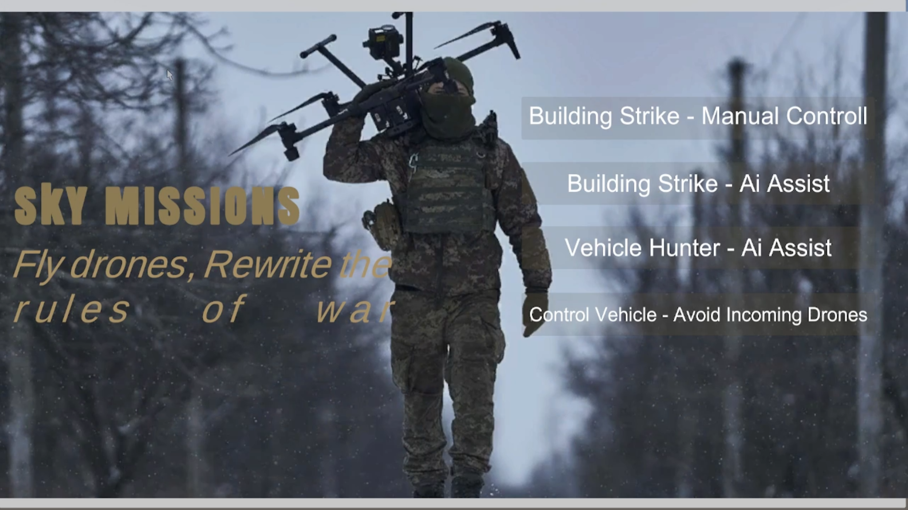
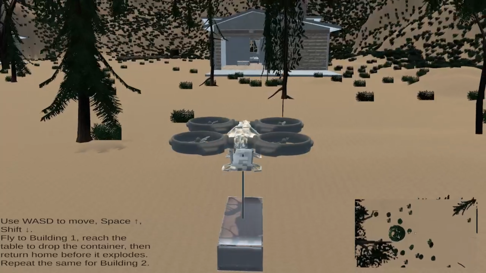
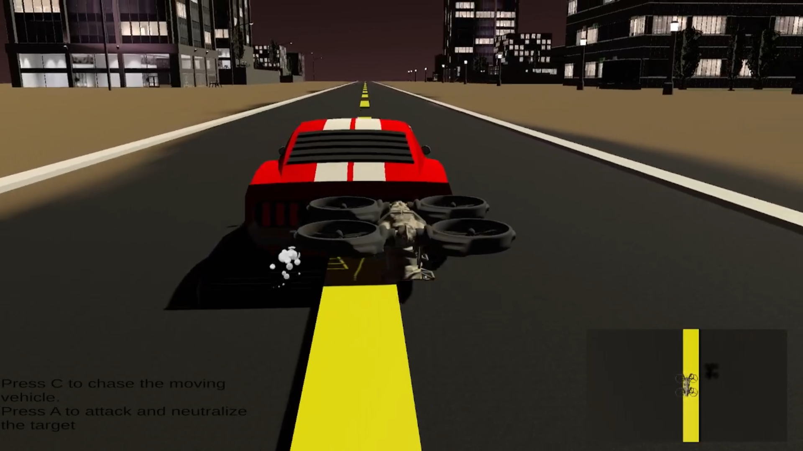
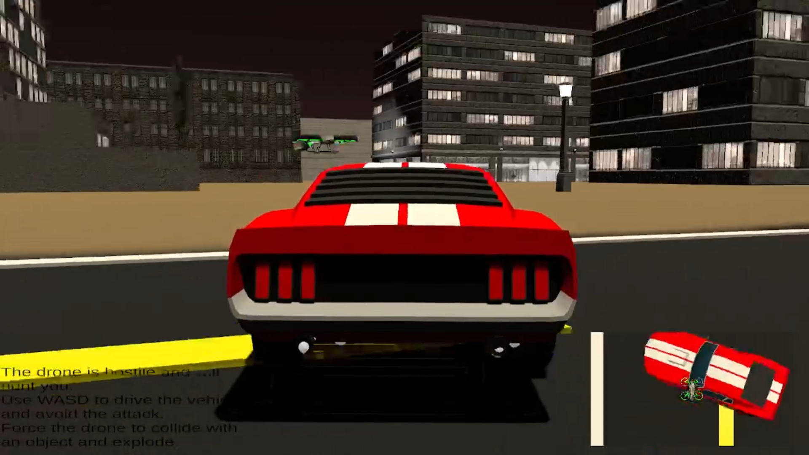

# SKY MISSIONS: Machine Learning & Game Development

[cite_start]**Sky Missions** is an advanced 3D drone simulation developed in Unity[cite: 3, 12]. [cite_start]It features a drone trained using **Reinforcement Learning** to navigate complex environments, avoid obstacles, and execute mission protocols autonomously[cite: 13, 14, 17].

---

## 🎮 Download & Play
To download the game, click the link for your OS and then click the **"View Raw"** button on the next page.

* **[Download for Windows](#)** (Replace # with your file link)
* **[Download for Linux](#)** (Replace # with your file link)

---

## 🖼️ Main Menu

---

## 🕹️ Missions

### 01 – Building Strike (Manual Control)
* [cite_start]**Purpose:** Compare human control against AI behavior[cite: 106].
* [cite_start]**Flow:** Navigate the drone into a building and deploy the payload manually[cite: 107].
* [cite_start]**Controls:** Use **WASD** to fly[cite: 107].

---

### 02 – Building Strike (AI Assist)
* [cite_start]**Purpose:** Autonomous drone strike with AI navigation[cite: 108].
* [cite_start]**Flow:** Drone starts camouflaged, flies to target, strikes, and returns home[cite: 109].
* [cite_start]**Controls:** * `1` or `2`: Select Target Building[cite: 109].
    * [cite_start]`H`: Return to Home[cite: 109].

.png)

---

### 03 – Vehicle Hunter (AI Assist)
* [cite_start]**Purpose:** Target tracking of a moving vehicle[cite: 110].
* [cite_start]**Flow:** Drone tracks the vehicle autonomously and triggers an engagement sequence[cite: 111].
* [cite_start]**Controls:** * `C`: Command chase[cite: 111].
    * [cite_start]`A`: Trigger attack[cite: 111].

---

### 04 – Control Vehicle (Avoid Drone)
* [cite_start]**Purpose:** Evasion scenario against an AI drone[cite: 112].
* [cite_start]**Flow:** You drive the vehicle; the AI drone hunts you[cite: 113].
* [cite_start]**Controls:** **WASD** to drive the vehicle[cite: 113].

---

## 🧠 Technical Overview
* [cite_start]**Algorithm:** Proximal Policy Optimization (PPO) via Unity ML-Agents[cite: 38].
* [cite_start]**Sensing:** Sphere-based detection for 360-degree obstacle awareness[cite: 41, 51].
* [cite_start]**Training Logic:** We used **Reward Shaping** to solve "Catastrophic Forgetting," where the drone would prioritize avoiding obstacles over its mission[cite: 62, 73, 75].
